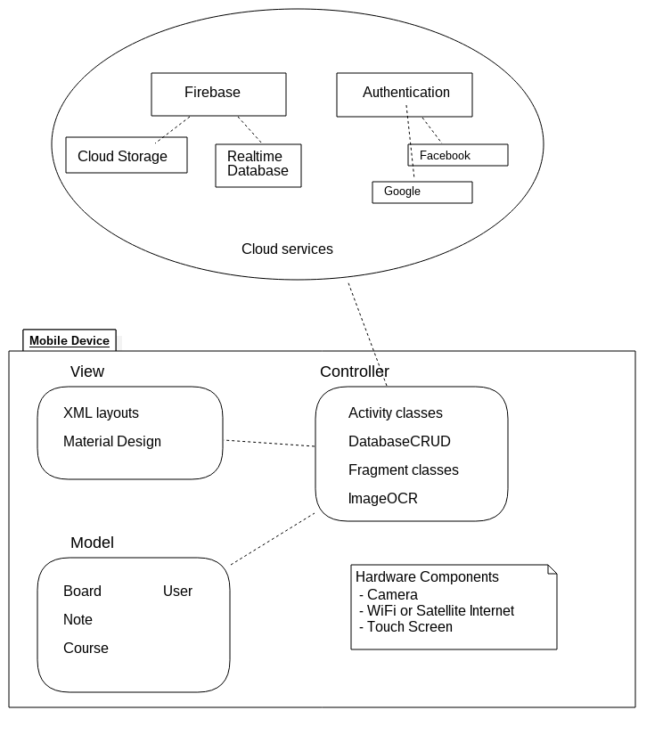

# Snapnotes

> Is an android application focused on taking photo notes.
manages all pictures base on your activities and your schedule. 
With snapnotes you can create your own schedule or sync with google calendar.
>
>The philosophy behind snapnotes is to easily take photos of your class notes and to have a quick and neat access to them.

 

# Build with & Tested with
- Android Studio 3.0.1
- Build API 27
- Nexus 6P running Android 8.1 (Oreo)

# Features
 - Material Design
 - Custom Camera 
 - ViewPager
 - Swipe gestures 
 - Swipe ImagePreview to next or dismiss 
 - ImageOCR
 - Sync between multiple devices
 - Cloud Storage
 
 ## Built With
 
 * [Butter Knife](https://github.com/JakeWharton/butterknife) - Field and method binding for Android views
 * [Glide](https://bumptech.github.io/glide/) - An image loading and caching library for Android focused on smooth scrolling 
 * [Firebase](https://firebase.google.com/) - Firebase helps you build better mobile apps and grow your business.
 * [Fresco](http://frescolib.org/) - An image managment library.
 * [Mobile Vision](https://developers.google.com/vision/) - Find objects in photos and video, using real-time on-device vision technology.
 
 # Disclaimer 
 - For sync, on the second device you need to skip calendar setup. 
 
# Architecture Diagram
 

# Develop by 
* Martin Ruiz Guadarrama
* Erik Martin Aleman
* Isaac Secundino Montoya

# Licence
MIT &copy; Snapnotes

 
 

